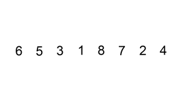

# 147. Insertion Sort List

tags: `Medium` `Linked List` `Sort`
links: https://leetcode.com/problems/insertion-sort-list/description/

---

Given the head of a singly linked list, sort the list using insertion sort, and return the sorted list's head.

The steps of the insertion sort algorithm:

Insertion sort iterates, consuming one input element each repetition and growing a sorted output list.
At each iteration, insertion sort removes one element from the input data, finds the location it belongs within the sorted list and inserts it there.
It repeats until no input elements remain.
The following is a graphical example of the insertion sort algorithm. The partially sorted list (black) initially contains only the first element in the list. One element (red) is removed from the input data and inserted in-place into the sorted list with each iteration.


 
Example 1:


```
Input: head = [4,2,1,3]
Output: [1,2,3,4]
```
Example 2:


```
Input: head = [-1,5,3,4,0]
Output: [-1,0,3,4,5]
```
Constraints:

* The number of nodes in the list is in the range [1, 5000].
* -5000 <= Node.val <= 5000

----

本质上考察的是单向链表交换两个节点。因为是单向链表，那么交换两个节点必然涉及被交换的两个节点前面的节点，所以总共需要四个指针。

其中`cur`和`curPre`分别指向当前链表遍历到的位置，以及当前遍历到的位置的前一个为止。`tmp`和`tmpPre`分别表示链表的第一个节点，以及`dummy`节点。

增加一个`dummy`节点可以让整个链表处理起来免去处理首部节点的一些边界情况。

在交换两个节点的时候，需要关注的一种情况就是当`curPre`和`tmp`重合的情况，此时相当于交换两个相邻节点，其他情况则属于不相邻交换的情况。

只需要注意每次交换完更新`cur`和`curPre`。


```java
/**
 * Definition for singly-linked list.
 * public class ListNode {
 *     int val;
 *     ListNode next;
 *     ListNode() {}
 *     ListNode(int val) { this.val = val; }
 *     ListNode(int val, ListNode next) { this.val = val; this.next = next; }
 * }
 */
class Solution {
    public ListNode insertionSortList(ListNode head) {
        ListNode dummy = new ListNode(-1);
        dummy.next = head;
        
        ListNode curPre = head;
        ListNode cur = head.next;

        while (cur != null) {
            ListNode tmpPre = dummy;
            ListNode tmp = dummy.next;

            while (cur.val > tmp.val && tmp != cur) {
                tmpPre = tmp;
                tmp = tmp.next;
            }

            if (tmp == cur) {
                curPre = cur;
                cur = cur.next;
            } else {
                if (curPre == tmp) {
                    ListNode curNext = cur.next;
                    tmpPre.next = cur;
                    cur.next = tmp;
                    tmp.next = curNext;
                    cur = curNext;
                    curPre = tmp;
                } else {
                    ListNode curNext = cur.next;
                    cur.next = tmpPre.next;
                    tmpPre.next = cur;
                    curPre.next = curNext;
                    cur = curNext;
                }
            }
        }

        return dummy.next;
    }
}
```